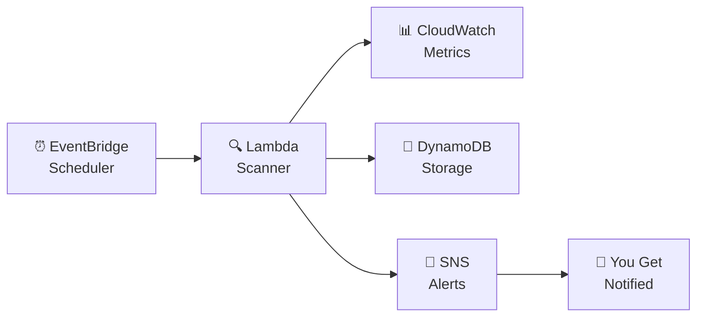

# ⚡ AWS Cost Optimizer
### *Because paying for cloud resources you're not using is just money down the drain.*

---

> **"You spin up an EC2 instance. You forget about it. You get a bill. You cry."**
> — Every developer who has ever used AWS.

This project exists to make sure that never happens to you again.

---

## 😩 The Problem (You've Been There)

Imagine this:

You're building something on AWS. You launch a few EC2 instances, test your stuff, and move on. A month later — **surprise!** Your AWS bill is way higher than expected. You dig in and realize those test servers were running 24/7... doing absolutely nothing.

Sound familiar? You're not alone.

This is one of the **biggest pain points** for anyone using AWS:
- Forgetting to shut down resources after testing
- Not knowing which services are sitting idle
- Getting zero warnings before a massive bill arrives
- Having no visibility into where your money is actually going

The average developer or team wastes **30–40% of their cloud budget** on resources they don't even use.

**That's the problem. This project is the solution.**

---

## ✅ What This Project Does

**AWS Cost Optimizer** is a fully serverless system that watches your AWS account 24/7, detects idle and underutilized resources, and alerts you in real time — so you can act before it costs you.

Think of it as your **personal AWS money-saving watchdog** 🐕 that never sleeps.

```
Your AWS Account
      │
      ▼
  🔍 Scanner runs every 6 hours
      │
      ▼
  📊 Checks CloudWatch metrics
      │
      ├── Idle resource found? ── YES ──▶ 💾 Save to DynamoDB
      │                                          │
      │                                          ▼
      │                                   📲 Send SMS Alert
      │
      └── No issues? ── ✅ All good, check again later
```

---

## 🏗️ Architecture



---

## ☁️ AWS Services Used & Why

| Service | Role | Why It's Used |
|---|---|---|
| **AWS Lambda** | Brain of the system | Runs code without a server — scales automatically |
| **Amazon CloudWatch** | Eyes of the system | Monitors CPU, network, and usage metrics |
| **Amazon DynamoDB** | Memory of the system | Stores all detected idle resource findings |
| **Amazon SNS** | Voice of the system | Sends you real-time SMS alerts |
| **Amazon EventBridge** | Heartbeat of the system | Triggers the scanner every 6 hours automatically |
| **AWS IAM** | Security guard | Controls what the system is allowed to touch |

---

## 🧠 How the Scanner Works (The Code)

The scanner has two key functions inside `scanner.py`:

**`estimate_ec2_cost(instance_type)`** — Looks up how much each EC2 instance type costs per month and flags it if it's idle.

**`estimate_rds_cost(db_class)`** — Same logic for RDS databases. For example:
- `db.t3.micro` → ~$15/month
- `db.m5.large` → ~$130/month
- `db.r5.xlarge` → ~$350/month

> 👇 Here's what the scanner code looks like in VS Code:


---

## 🛠️ Step-by-Step Setup

### Prerequisites
- An AWS account (free tier works!)
- Python 3.8+ installed
- AWS CLI installed

---

### 🔹 Step 1 — Configure AWS CLI

Open your terminal and run:
```bash
aws configure
```

Provide:
- **AWS Access Key ID** → from your AWS IAM user
- **AWS Secret Access Key** → from your AWS IAM user
- **Default Region** → `us-east-1`
- **Output format** → press Enter

---

### 🔹 Step 2 — Download the Project

```bash
git clone https://github.com/your-username/aws-cost-optimizer
cd aws-cost-optimizer
```

---

### 🔹 Step 3 — Install Dependencies

```bash
pip install boto3
```

---

### 🔹 Step 4 — Configure Your Settings

Open `deploy.py` and update the `CONFIG` section:

```python
CONFIG = {
    "region": "us-east-1",
    "phone_number": "+91XXXXXXXXXX",
    "project_name": "cost-optimizer",
    "cpu_threshold": 5,
    "idle_days": 7
}
```

---

### 🔹 Step 5 — Deploy Everything

```bash
python deploy.py
```

This one command automatically creates **everything** in your AWS account. After it runs successfully, you'll see **2 Lambda functions** created in the AWS Console:

> 👇 Your Lambda console should look exactly like this:


Both functions are:
- `cost-optimizer-scanner` → scans your AWS resources
- `cost-optimizer-executor` → takes action when idle resources are found
- Runtime: **Python 3.12**
- Package type: **Zip**

---

### 🔹 Step 6 — Set Lambda Environment Variables

Go to:
**AWS Console → Lambda → cost-optimizer-scanner → Configuration → Environment Variables → Edit**

Add these key-value pairs:

> 👇 Your environment variables page should look like this:


| Key | Value |
|---|---|
| `DYNAMODB_TABLE` | `cost-optimizer-findings` |
| `SNS_TOPIC_ARN` | *(copy from your SNS console — looks like `arn:aws:sns:us-east-1:XXXX:cost-optimizer-alerts`)* |
| `SNS-THRESHOLD` | `5` |
| `IDLE_DAYS` | `7` |

> ⚠️ **Note:** You can see in the screenshot that `DYNAMODB_TABLE` appears twice — remove the duplicate. Keep `API_BASE_URL` and `APPROVAL_TOKEN` if your deploy script added them.

Click **Save** when done.

---

### 🔹 Step 7 — Test the System Manually

Don't wait 6 hours — trigger the scanner right now from your terminal:

```bash
aws lambda invoke \
  --function-name cost-optimizer-scanner \
  --region us-east-1 \
  --payload "{}" \
  out.json
```

> 👇 Here's what a successful invocation looks like in VS Code terminal:


You'll get a response like:
```json
{
  "StatusCode": 200,
  "FunctionError": "Unhandled",
  "ExecutedVersion": "$LATEST"
}
```

> 💡 `StatusCode: 200` means the Lambda was **reached and executed**. If you see `FunctionError: Unhandled`, check the CloudWatch logs in the next step.

---

### 🔹 Step 8 — Check CloudWatch Logs

To see what happened inside the Lambda, run:

```bash
aws logs tail /aws/lambda/cost-optimizer-scanner --region us-east-1 --since 5m
```

> 👇 This is what the logs look like in the terminal:


**Common log messages explained:**

| Log Message | What it means |
|---|---|
| `START RequestId` | Lambda started running |
| `END RequestId` | Lambda finished |
| `REPORT Duration: 100ms` | How long it took |
| `Runtime.ImportModuleError` | A Python package is missing — check your zip deployment |
| `Status: error` | Something went wrong — read the error type |

> ⚠️ If you see `Runtime.ImportModuleError` — it means a Python library wasn't included in the deployment zip. Re-run `python deploy.py` to fix.

---

### 🔹 Step 9 — Verify Results in DynamoDB

Go to:
**AWS Console → DynamoDB → Tables → cost-optimizer-findings → Explore items**

You'll see entries like:
```json
{
  "resourceId": "i-0abc123456",
  "resourceType": "EC2",
  "detail": "CPU usage below 5% for 7 days",
  "status": "PENDING"
}
```

---

### 🔹 Step 10 — Check SMS Alert

If a real idle resource was found → **check your phone**. You should receive an SMS from SNS with the finding details. 📲

---

## 🔁 How Automation Works

Once deployed, you don't need to do anything:

```
Every 6 hours
     │
     ▼
EventBridge fires the Lambda
     │
     ▼
Scanner checks all EC2, RDS resources
     │
     ├── Idle found? → Store in DynamoDB → SMS alert sent to you
     │
     └── All clean? → Sleep until next trigger
```

---

## 🧪 Quick Test Scenario

Want to see it work end to end?

1. Launch a new EC2 instance (t2.micro — free tier)
2. Don't do anything on it — let it sit idle
3. Run the scanner manually (Step 7)
4. Check DynamoDB → your instance should appear
5. Check your phone → SMS alert received ✅

---

## 🧹 Cleanup — Remove Everything

```bash
python deploy.py --destroy
```

Deletes all Lambda functions, DynamoDB table, SNS topic, EventBridge rules, and IAM roles. Clean slate.

---

## 💡 Key Features

```
✅  Fully serverless — no servers to manage
✅  Auto-detects idle EC2 and RDS instances
✅  Real-time SMS alerts when waste is found
✅  All findings stored in DynamoDB
✅  Auto-runs every 6 hours via EventBridge
✅  One-command deploy AND destroy
✅  Configurable thresholds (CPU %, idle days)
```

---

## 🔮 What's Coming Next

- 🔴 **Auto-stop** idle EC2 instances (not just alert — actually act)
- 📧 **Email + Slack** notifications
- 🌐 **Web dashboard** to visualize all findings
- 🔍 **Multi-service scanning** — EBS, S3, and more
- 📈 **Cost savings tracker** over time

---

## 🧠 The Big Idea

Most people don't realize how much they waste on cloud until they see the bill.

This project makes cloud costs **visible and automatic** — you get warned before a problem happens, not after you've already paid for it.

It's not a complete solution to every cloud cost problem. But it's a **real, working system** that genuinely helps catch waste early — and that's a great start.

---

## 👨‍💻 Built By

**Arkan Tandel**
Passionate about cloud, automation, and building things that actually solve real problems.

---

*"The best code is code that saves you money while you sleep."* 💤💰
